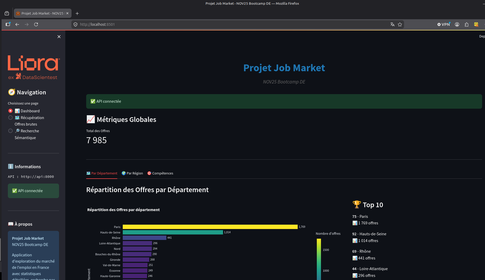
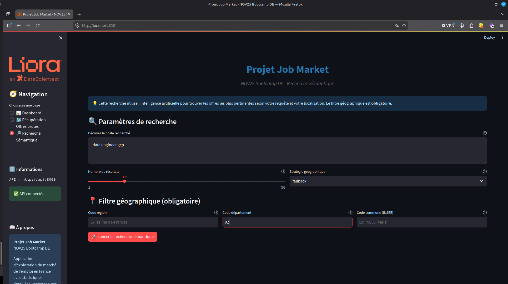
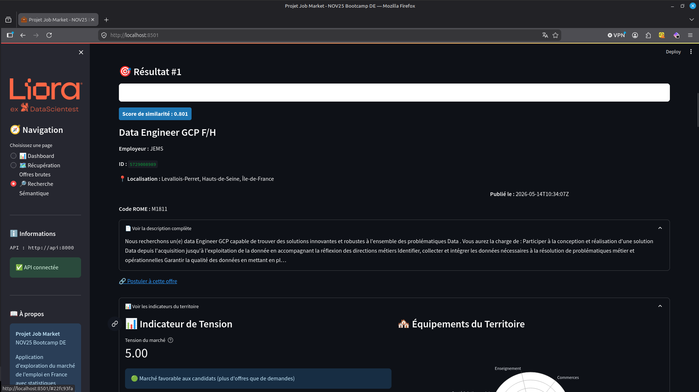

# 💼 JobMarket — Analyse du Marché de l'Emploi en France


## 📋 Description

**Problème résolu :** Comprendre les dynamiques du marché de l'emploi en France nécessite d'agréger des données hétérogènes (offres, tensions sectorielles, démographie) dispersées entre plusieurs APIs publiques et privées.

**Solution apportée :** Un pipeline ELT automatisé qui collecte, transforme et centralise les données de 5 sources (France Travail, Adzuna, JSearch, INSEE, Data.gouv), exposées via une API FastAPI et une interface Streamlit avec **recherche sémantoqie d'offres d'emplois** par similarité cosinus.

---

## 🎬 Démo

### Statistiques des offres



### Moteur de recherche sémantique



### Exemple de résultats



---

## ⚡ Installation Rapide

**Prérequis :** Docker & Docker Compose installés.

```bash
# 1. Cloner le repository
git clone https://github.com/GaelleRoger/jobmarket-moteur-recommandations.git
cd jobmarket-moteur-recommandations

# 2. Première installation (build des conteneurs + initialisation)
./install.sh

# 3. Démarrages suivants
./start.sh
```

L'interface Streamlit est accessible sur `http://localhost:8501` et l'API sur `http://localhost:8000`.

---

## 🔧 Fonctionnalités

- **Recherche sémantique offres d'emploi** — recherche multi-critères (poste, localisation, secteur) agrégée depuis plusieurs sources. Similarité cosinus entre une requête et les offres via `sentence-transformers`
- **Visualisations interactives** — cartes, histogrammes et indicateurs de tension du marché du travail avec Plotly
- **Pipeline ELT orchestré** — extraction automatisée des données d'offres via Airflow, stockage MongoDB + indexation Elasticsearch
- **Données contextuelles INSEE** — population, équipements, communes pour enrichir les analyses géographiques

---

## 📊 Données & Résultats

### 📡 Sources intégrées

| Source         | Type de données                                      |
| -------------- | ---------------------------------------------------- |
| France Travail | Offres d'emploi, codes ROME, indicateurs de tension  |
| Adzuna         | Offres d'emploi (secteur privé)                      |
| JSearch        | Offres d'emploi internationales                      |
| INSEE          | Population, équipements par commune                  |
| Data.gouv      | Référentiel des communes françaises                  |

### 📁 Architecture des données

```plaintext
data/
├── raw/          # Données brutes par source
│   ├── adzuna/
│   ├── france_travail/
│   ├── insee_eqpt/
│   └── jsearch/
└── processed/    # Données transformées et unifiées
    └── unified/
```

---

## 🗂️ Structure du Projet

```plaintext
NOV25-BDE-JOBMARKET/
├── airflow/          # DAGs et configuration Airflow
├── src/
│   ├── ELT/          # Extract / Load / Transform par source
│   ├── api/          # Backend FastAPI + interface Streamlit
│   ├── pipelines/    # Scripts d'orchestration
│   └── models/       # Modèles de matching sémantique
├── docker-compose.yml
├── install.sh
└── start.sh
```

---

## 🛠️ Stack Technique


---

## 👤 Contact

**Projet réalisé en équipe** dans le cadre du Bootcamp Data Engineering — [DataScientest](https://datascientest.com/).

**Contact** Gaëlle Roger

- 💼 **Recruteurs :** Disponible pour de nouvelles opportunités — [LinkedIn](https://www.linkedin.com/in/gaelle-roger/)
- 🤝 **Contributeurs :** Issues et Pull Requests bienvenues !

---

⭐ **Ce projet vous a plu ?** N'hésitez pas à laisser une étoile !
